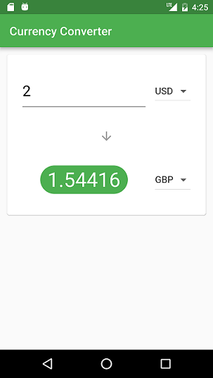

# Flutter Currency Converter

A cool currency converter created with Flutter.

Link to the YouTube tutorial
[Currency Converter Tutorial](https://www.youtube.com/watch?v=sisZllMjoX0).

## What you'll learn

- Building Layouts
- Fetching and manipulating JSON data asynchronously
- Conditional Rendering
- DRY Concepts through reusable widgets
- and lots more

## Getting Started

For help getting started with Flutter, view our online
[documentation](https://flutter.io/).
